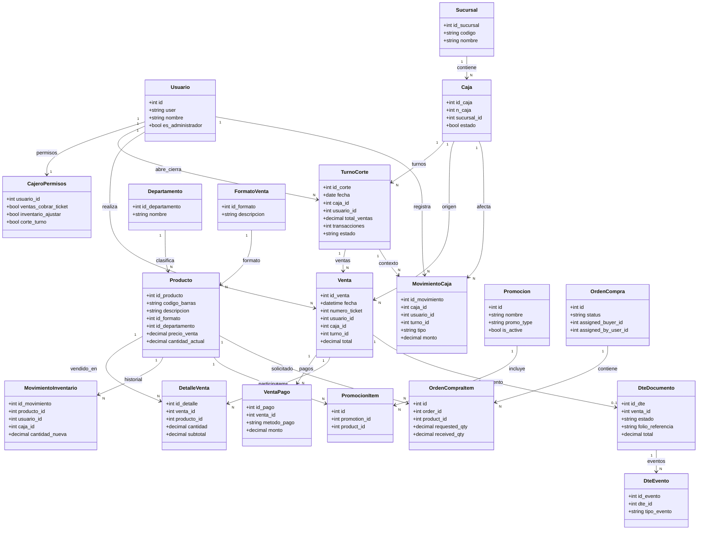

# Diagrama De Clases (Dominio Funcional)

Nota:
- Este diagrama modela el dominio funcional del sistema (no clases JS literales).
- Sirve para arquitectura, documentacion y onboarding tecnico.

## Explicacion Rapida
1. `Venta` es el centro operativo: une cajero, caja, turno, pagos y detalle de productos.
2. `VentaPago` permite representar pagos mixtos de forma nativa.
3. `TurnoCorte` consolida ventas y movimientos de caja.
4. `Producto` se conecta a inventario, promociones y compras.
5. `DteDocumento` y `DteEvento` agregan trazabilidad tributaria sobre la venta.

