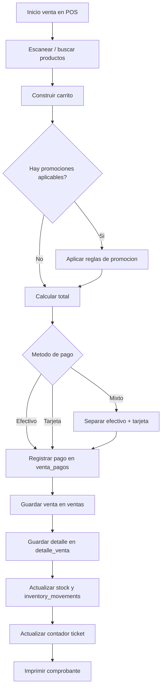
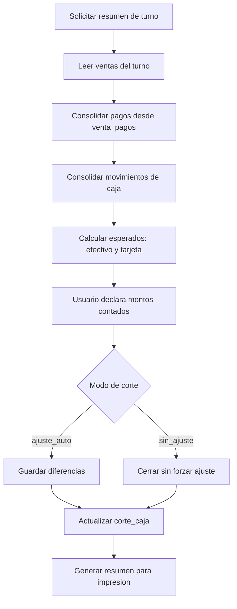
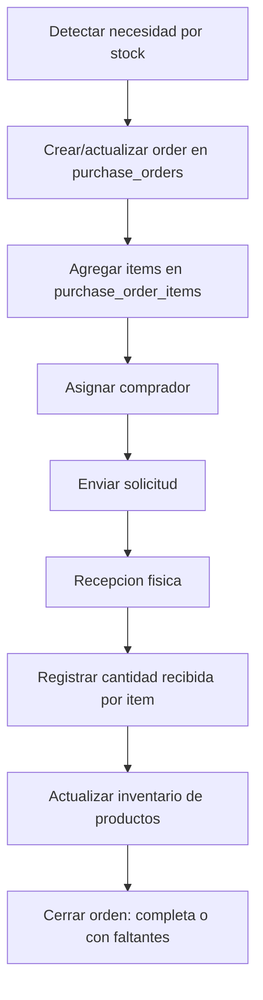
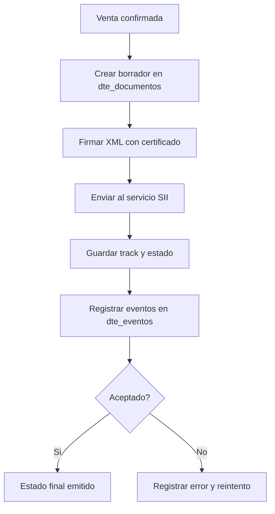

# Flujos De Trabajo (Operacion Del Sistema)

Este documento resume los flujos mas usados en operacion diaria.

## 1) Flujo Principal De Venta (Con Pago Mixto)

## 2) Flujo De Cierre De Turno (Corte De Caja)

## 3) Flujo De Compras Y Recepcion

## 4) Flujo DTE (Documento Tributario Electronico)

## Recomendacion Operativa
1. Para soporte rapido: revisar siempre `ventas` + `venta_pagos` + `cash_movements` + `corte_caja`.
2. Para desfases de mixto: tomar `venta_pagos` como fuente principal y `ventas.metodo_pago` como apoyo.
3. Para auditoria: cruzar ticket (`ventas.numero_ticket` / `folio_ticket`) con `detalle_venta` y `dte_documentos`.

